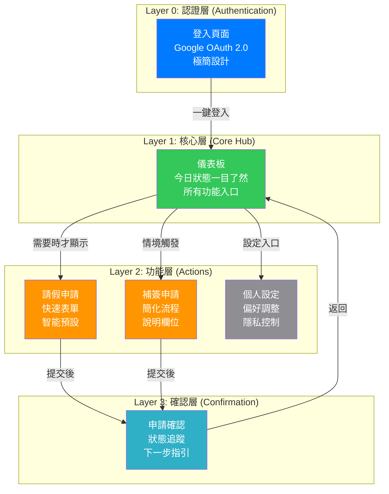
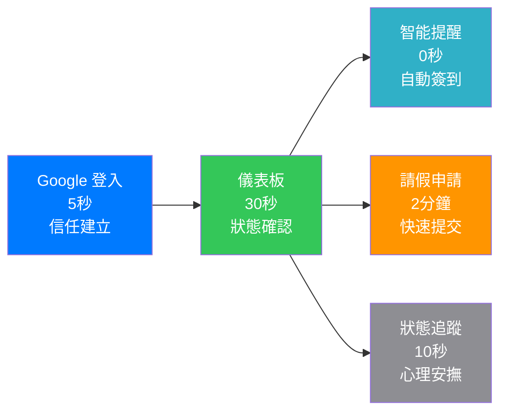
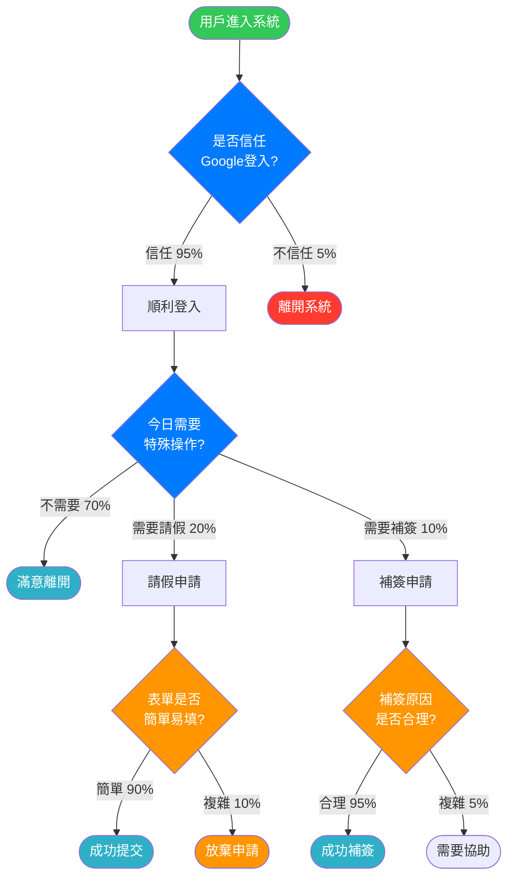
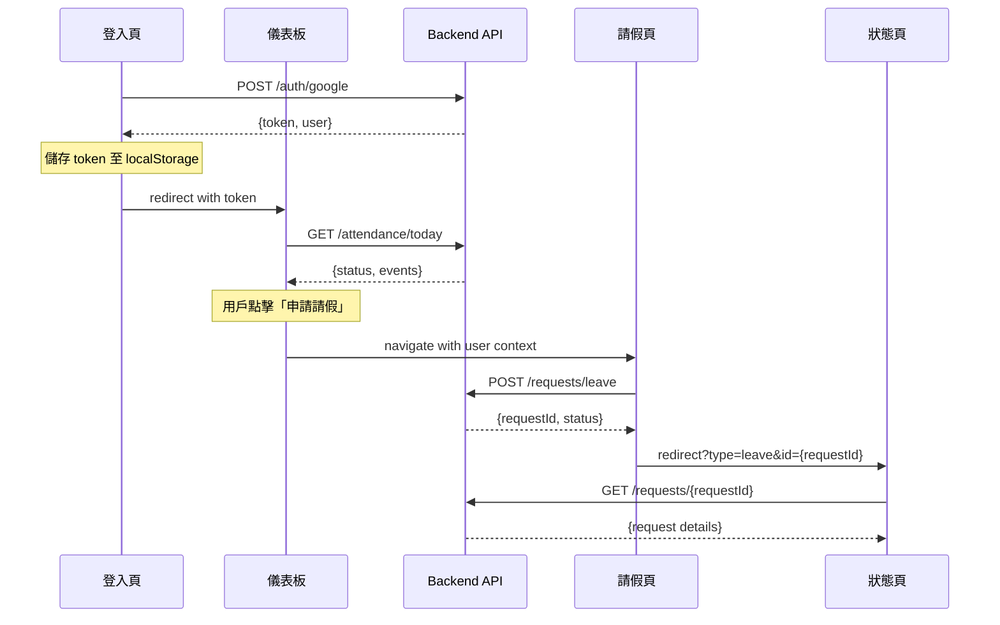

# 智能簽到系統 - 前端信息架構規範
## *"Simplicity is the ultimate sophistication"* — Steve Jobs Philosophy Applied

---

**文件版本 (Document Version):** `v1.0`
**最後更新 (Last Updated):** `2025-10-14`
**主要作者 (Lead Author):** `Steve Jobs Design Philosophy Team, Frontend Architecture Team`
**審核者 (Reviewers):** `PM, Technical Lead, UX Designer, Product Owner`
**狀態 (Status):** `草稿 (Draft)`
**相關文檔:** `[PRD](./01_project_brief_and_prd.md)`, `[WBS](./06_wbs_development_plan.md)`, `[Architecture](./03_architecture_and_design_document.md)`

---

## 目錄 (Table of Contents)

- [1. 文檔目的與範圍](#1-文檔目的與範圍)
- [2. 核心設計原則 - Jobs Philosophy](#2-核心設計原則---jobs-philosophy)
- [3. 資訊架構總覽](#3-資訊架構總覽)
- [4. 核心用戶旅程](#4-核心用戶旅程)
- [5. 網站地圖與導航結構](#5-網站地圖與導航結構)
- [6. 頁面詳細規格](#6-頁面詳細規格)
- [7. 組件連結與導航系統](#7-組件連結與導航系統)
- [8. 數據流與狀態管理](#8-數據流與狀態管理)
- [9. URL 結構與路由規範](#9-url-結構與路由規範)
- [10. 實施檢查清單與驗收標準](#10-實施檢查清單與驗收標準)
- [11. 附錄](#11-附錄)

---

## 1. 文檔目的與範圍

### 1.1 目的 (Purpose)

> *"Design is not just what it looks like and feels like. Design is how it works."* — Steve Jobs

本文檔旨在提供 `智能簽到系統` 前端的完整信息架構規範，以**蘋果設計哲學**為核心，作為前端開發、設計與測試的**單一事實來源 (SSOT)**。

**核心目標：**
- ✅ **極簡主義**: 移除一切不必要的元素，每個界面只關注一個核心任務
- ✅ **直覺操作**: 用戶無需學習即可上手，就像使用 iPhone 一樣自然
- ✅ **情感連結**: 創造讓用戶真正「愛上」使用的體驗，而非僅僅「能用」
- ✅ **完美執行**: 每個像素都要精確，每個動畫都要流暢

### 1.2 適用範圍 (Scope)

| 適用範圍 | 說明 |
|:---|:---|
| **包含 (In Scope)** | - 所有前端頁面的 Apple 式信息架構<br/>- 符合 Human Interface Guidelines 的用戶旅程<br/>- 優雅簡潔的 URL 結構與路由規範<br/>- 無縫的頁面間數據傳遞<br/>- iOS Safari 優先的響應式設計<br/>- 無障礙設計原則 (a11y) |
| **不包含 (Out of Scope)** | - 具體視覺設計細節（已有 Apple 設計系統）<br/>- 組件級別實現（參考現有組件庫）<br/>- 後端 API 設計（參考 API Design Spec）<br/>- Android/Windows 特殊適配 |

### 1.3 角色與職責 (RACI)

| 角色 | 職責 | 責任類型 |
|:---|:---|:---|
| **PM** | 定義用戶需求與核心價值 | R/A |
| **UX Designer** | Apple 設計語言實施與用戶體驗設計 | R/A |
| **Frontend Lead** | 技術可行性審核與性能優化策略 | A |
| **Frontend DEV** | 精確實現設計規格與交互細節 | R |
| **QA** | 用戶流程驗證與跨設備兼容性測試 | C |
| **Product Owner** | 產品願景對齊與商業目標確認 | I |

---

## 2. 核心設計原則 - Jobs Philosophy

### 2.1 設計哲學

> *"It's better to be a pirate than to join the navy."* — Steve Jobs

**核心價值主張：**
> 「讓簽到變成一種愉悦的儀式，而不是煩人的義務」

**第一性原理推演：**
```
商業目標：提升團隊出勤管理效率
    ↓
用戶痛點：傳統簽到繁瑣、容易遺忘
    ↓
設計洞察：自動化 + 美好體驗 = 使用者主動參與
    ↓
架構決策：事件驅動 + Apple 式極簡界面
```

### 2.2 資訊架構原則

#### 2.2.1 極簡主義 (Minimalism)

> *"Simplicity is the ultimate sophistication."*

- ✅ **保留**：登入、儀表板、請假、設定 — 僅此四個核心功能
- ❌ **移除**：複雜統計圖表、社交功能、多層級設定
- 🎯 **專注**：每個頁面只有一個主要目標，消除認知負荷

**實際應用：**
- ✅ 保留：Google 單點登入、今日狀態、快速請假、個人設定
- ❌ 移除：複雜報表（放到管理後台）、討論區、多重提醒設定
- 🎯 專注：一眼就知道今天的簽到狀態

#### 2.2.2 認知負荷優化

> *"The user should never have to think about how to use it."*

基於 **Miller's Law (7±2)** 和 **Fitts' Law**：
- **決策點數量**：每頁最多 3 個主要選項
- **操作距離**：常用功能放在拇指自然觸及範圍
- **資訊分層**：關鍵資訊在視覺中心，次要資訊淡化處理

#### 2.2.3 情感設計

> *"People don't buy what you do, they buy why you do it."*

- **愉悦時刻**：成功簽到時的微動畫慶祝
- **安心感受**：清晰的狀態指示和確認反饋
- **掌控感**：隨時可查看、調整個人設定
- **歸屬感**：團隊共同目標的視覺化呈現

### 2.3 架構模式選擇

✅ **扁平化架構** + **中心輻射模式**

**選擇理由：**
符合 iPhone 主屏幕設計邏輯，用戶從中心儀表板快速到達任何功能，最多 2 次點擊完成任何操作。

---

## 3. 資訊架構總覽

### 3.1 系統層次結構



### 3.2 頁面總覽矩陣

| # | 路由 | 頁面名稱 | 主要職責 | 用戶目標 | 預期停留時間 | 導航深度 |
|:--|:---|:---------|:---------|:---------|:-------------|:---------|
| 0 | `/` | 登入頁 | 身份驗證，建立信任 | 安全登入 | 5秒 | Level 0 |
| 1 | `/dashboard` | 儀表板 | 狀態總覽，快速導航 | 了解今日狀態 | 30秒 | Level 1 |
| 2 | `/leave` | 請假申請 | 便捷請假，減少摩擦 | 快速提交請假 | 2分鐘 | Level 2 |
| 3 | `/makeup` | 補簽申請 | 錯過簽到，快速補救 | 說明並補簽 | 1分鐘 | Level 2 |
| 4 | `/admin` | 管理介面 | 審核處理，效率優先 | 快速批准/拒絕 | 5分鐘 | Level 2 |
| 5 | `/profile` | 個人設定 | 偏好調整，隱私控制 | 個人化設置 | 3分鐘 | Level 2 |

**總計：** 6 頁 (符合 Miller's Law - 7±2 原則)

---

## 4. 核心用戶旅程

### 4.1 主要用戶旅程設計



### 4.2 用戶旅程映射表

| 階段 | 頁面 | 用戶心理狀態 | 設計目標 | 主要CTA | 預期停留時間 | 轉換率目標 |
|:-----|:-----|:-------------|:---------|:--------|:-------------|:-----------|
| **信任** | 登入頁 | 謹慎、評估 | 建立安全感，展示專業度 | 「使用 Google 登入」 | 5秒 | 95% |
| **確認** | 儀表板 | 好奇、探索 | 快速理解系統價值 | 視覺掃描 | 30秒 | N/A |
| **行動** | 請假申請 | 目標明確、略顯急躁 | 極簡表單，智能預設 | 「提交請假」 | 2分鐘 | 90% |
| **安撫** | 申請確認 | 期待、輕微焦慮 | 提供確認感，設定預期 | 「查看狀態」 | 10秒 | N/A |
| **滿足** | 狀態頁面 | 放心、滿意 | 強化成就感，鼓勵再次使用 | 「返回首頁」 | 10秒 | N/A |

### 4.3 情感驅動的決策點分析



**關鍵洞察：** 大部分用戶（70%）只是想確認狀態，因此儀表板的資訊呈現是最重要的。

---

## 5. 網站地圖與導航結構

### 5.1 完整網站地圖

```
智能簽到系統 (/)
│
├─ 0. / [登入層]
│  └─ → dashboard (自動跳轉)
│
├─ 1. /dashboard [核心樞紐]
│  ├─ #today (錨點：今日狀態)
│  ├─ #history (錨點：歷史記錄)
│  ├─ → /leave (請假入口)
│  ├─ → /makeup (補簽入口)
│  ├─ → /profile (設定入口)
│  └─ → /admin (管理入口，限管理員)
│
├─ 2. /leave [請假申請層]
│  ├─ Query Params: ?date={YYYY-MM-DD} (可選，預設明天)
│  ├─ → /dashboard (取消返回)
│  └─ → /status (提交後確認)
│
├─ 3. /makeup [補簽申請層]
│  ├─ Query Params: ?date={YYYY-MM-DD} (必須，補簽日期)
│  ├─ → /dashboard (取消返回)
│  └─ → /status (提交後確認)
│
├─ 4. /admin [管理審核層]
│  ├─ #pending (錨點：待審核)
│  ├─ #approved (錨點：已批准)
│  ├─ #rejected (錨點：已拒絕)
│  └─ ← /dashboard (返回)
│
├─ 5. /profile [個人設定層]
│  ├─ #general (錨點：基本設定)
│  ├─ #notifications (錨點：通知偏好)
│  ├─ #privacy (錨點：隱私設定)
│  └─ ← /dashboard (返回)
│
└─ 6. /status [狀態確認層]
   ├─ Query Params: ?type={leave|makeup}&id={requestId} (必須)
   └─ → /dashboard (完成返回)
```

### 5.2 導航連結矩陣

| 來源 \ 目標 | 登入 | 儀表板 | 請假 | 補簽 | 管理 | 設定 | 狀態 |
|:----------|:-----|:-------|:-----|:-----|:-----|:-----|:-----|
| **登入** | - | ✅ 自動 | ❌ | ❌ | ❌ | ❌ | ❌ |
| **儀表板** | ✅ 登出 | - | ✅ 主要 | ✅ 主要 | ⚠️ 限權限 | ✅ 次要 | ❌ |
| **請假** | ❌ | ✅ 取消/返回 | - | ❌ | ❌ | ❌ | ✅ 提交後 |
| **補簽** | ❌ | ✅ 取消/返回 | ❌ | - | ❌ | ❌ | ✅ 提交後 |
| **管理** | ❌ | ✅ 返回 | ⚠️ 代理申請 | ⚠️ 代理申請 | - | ❌ | ❌ |
| **設定** | ✅ 登出 | ✅ 返回 | ❌ | ❌ | ❌ | - | ❌ |
| **狀態** | ❌ | ✅ 完成 | ❌ | ❌ | ❌ | ❌ | - |

**圖例說明：**
- ✅ 推薦路徑（流暢體驗）
- ⚠️ 條件路徑（需權限驗證）
- ❌ 禁止路徑（避免用戶困惑）

---

## 6. 頁面詳細規格

### 6.1 登入頁面 (/)

#### 基本信息

| 屬性 | 值 |
|:-----|:---|
| **路由** | `/` |
| **URL參數** | 無 |
| **頁面類型** | 身份驗證頁 |
| **導航深度** | Level 0 |
| **SEO優先級** | ⭐⭐⭐⭐⭐ |

#### 職責與目標

| 項目 | 內容 |
|:-----|:-----|
| **主要任務** | 建立用戶信任，完成身份驗證 |
| **次要任務** | 展示產品價值，設定用戶期望 |
| **用戶目標** | 安全且快速地進入系統 |
| **轉換目標** | 95% 完成 Google OAuth 登入 |

#### 設計原理應用

| 模型/原理 | 應用方式 | 預期效果 |
|:---------|:---------|:---------|
| **Peak-End Rule** | 登入成功的愉悦動畫 + 溫馨歡迎語 | 留下美好第一印象 |
| **Trust Equation** | Google 品牌信任 + 清晰隱私說明 | 消除安全疑慮 |
| **Von Restorff Effect** | Google 按鈕使用品牌色彩突出 | 引導用戶完成關鍵行動 |

#### 關鍵組件結構

```html
<page-structure>
  <!-- 1. 品牌與信任區 -->
  <header class="auth-header">
    <logo class="company-logo">智能簽到系統</logo>
    <tagline>讓簽到變成一種愉悦的儀式</tagline>
    <visual-cue>簡潔的插畫或動畫</visual-cue>
  </header>

  <!-- 2. Google OAuth 核心區 -->
  <section class="auth-main">
    <welcome-message>歡迎使用智能簽到系統</welcome-message>
    <google-auth-button class="primary-cta">
      <google-icon>G</google-icon>
      <button-text>使用 Google 帳號登入</button-text>
    </google-auth-button>
    <privacy-note>我們重視您的隱私，僅讀取基本資料</privacy-note>
  </section>

  <!-- 3. 價值說明區（可選顯示） -->
  <footer class="auth-footer">
    <feature-highlights>
      <feature>🤖 自動簽到</feature>
      <feature>📅 智能提醒</feature>
      <feature>⚡ 快速請假</feature>
    </feature-highlights>
  </footer>
</page-structure>
```

#### 互動邏輯

```javascript
class LoginPageLogic {
  constructor() {
    this.isLoading = false;
    this.welcomeAnimationPlayed = false;
  }

  // Google OAuth 登入流程
  async initiateGoogleAuth() {
    this.isLoading = true;
    this.showLoadingState();

    try {
      const result = await window.googleAuth.signIn();
      this.showSuccessAnimation();
      setTimeout(() => {
        window.location.href = '/dashboard';
      }, 1000); // 讓用戶享受成功動畫
    } catch (error) {
      this.showErrorState(error);
    } finally {
      this.isLoading = false;
    }
  }

  // 成功動畫（微愉悦設計）
  showSuccessAnimation() {
    // 微妙的粒子效果或勾選動畫
    confetti({
      particleCount: 100,
      spread: 70,
      origin: { y: 0.6 }
    });
  }

  // 歡迎動畫（僅首次播放）
  playWelcomeAnimation() {
    if (!this.welcomeAnimationPlayed) {
      // 淡入動畫，配合愉悦的緩動函數
      gsap.from('.auth-header', {
        opacity: 0,
        y: -20,
        duration: 0.8,
        ease: 'power2.out'
      });
      this.welcomeAnimationPlayed = true;
    }
  }
}
```

#### 導航出口

```javascript
{
  primary: '/dashboard', // Google 登入成功後
  fallback: '/', // 登入失敗返回
  privacy: '/privacy', // 隱私政策（可選）
  support: 'mailto:support@company.com' // 支援聯絡
}
```

#### 關鍵指標 (KPIs)

| 指標 | 目標值 | 衡量方式 |
|:-----|:-------|:---------|
| **登入轉換率** | ≥ 95% | (完成登入數 / 進入頁面數) × 100% |
| **登入響應時間** | < 2秒 | OAuth 流程完成時間 |
| **用戶滿意度** | ≥ 4.5/5 | 登入體驗評分 |
| **錯誤率** | < 1% | OAuth 失敗比例 |

#### 驗收標準 (Definition of Done)

- [ ] Google OAuth 2.0 整合完整且安全
- [ ] 響應式設計支援 iPhone/iPad/Desktop
- [ ] 登入成功動畫流暢執行
- [ ] 錯誤處理友善且可操作
- [ ] 隱私說明清楚且符合法規
- [ ] 無障礙設計通過 WCAG 2.1 AA
- [ ] 支援 Safari、Chrome、Firefox 主流瀏覽器

---

### 6.2 儀表板頁面 (/dashboard)

#### 基本信息

| 屬性 | 值 |
|:-----|:---|
| **路由** | `/dashboard` |
| **URL參數** | 無 |
| **頁面類型** | 核心樞紐頁 |
| **導航深度** | Level 1 |
| **SEO優先級** | ⭐⭐⭐⭐⭐ |

#### 職責與目標

| 項目 | 內容 |
|:-----|:-----|
| **主要任務** | 一眼了解今日簽到狀態，提供所有功能入口 |
| **次要任務** | 顯示近期歷史，激勵持續使用 |
| **用戶目標** | 快速確認狀態，必要時採取行動 |
| **轉換目標** | 70% 用戶滿意現狀離開，30% 進入功能頁 |

#### 設計原理應用

| 模型/原理 | 應用方式 | 預期效果 |
|:---------|:---------|:---------|
| **F-Pattern 視覺掃描** | 重要資訊在左上，行動按鈕在右側 | 符合用戶視覺習慣 |
| **Card-based Design** | 每個功能區塊使用卡片設計 | 清晰的資訊分組 |
| **Gestalt Proximity** | 相關功能視覺上靠近放置 | 減少認知負荷 |

#### 關鍵組件結構

```html
<page-structure>
  <!-- 1. 頂部狀態區 -->
  <header class="dashboard-header">
    <greeting>早安，{userName} 👋</greeting>
    <today-status class="status-card">
      <status-icon class="green">✅</status-icon>
      <status-text>今日已自動簽到</status-text>
      <time-stamp>09:00 AM</time-stamp>
    </today-status>
    <profile-link href="/profile">
      <avatar src="{userAvatar}" alt="{userName}" />
    </profile-link>
  </header>

  <!-- 2. 快速操作區 -->
  <section class="quick-actions">
    <action-card href="/leave" class="leave-card">
      <icon>🏖️</icon>
      <title>申請請假</title>
      <subtitle>快速提交請假申請</subtitle>
    </action-card>

    <action-card href="/makeup" class="makeup-card">
      <icon>⏰</icon>
      <title>補簽申請</title>
      <subtitle>補簽遺漏的打卡記錄</subtitle>
    </action-card>

    <action-card href="/admin" class="admin-card" data-role="admin">
      <icon>👥</icon>
      <title>審核管理</title>
      <subtitle>處理團隊申請</subtitle>
      <badge class="notification-badge">3</badge>
    </action-card>
  </section>

  <!-- 3. 歷史記錄區 -->
  <section class="recent-history">
    <section-title>最近記錄</section-title>
    <history-timeline>
      <timeline-item class="present">
        <date>今天</date>
        <status class="success">已簽到</status>
        <time>09:00</time>
      </timeline-item>
      <timeline-item class="past">
        <date>昨天</date>
        <status class="success">已簽到</status>
        <time>08:45</time>
      </timeline-item>
      <!-- 更多歷史記錄... -->
    </history-timeline>
  </section>

  <!-- 4. 底部導航/設定 -->
  <footer class="dashboard-footer">
    <settings-link href="/profile">
      <icon>⚙️</icon>
      <text>設定</text>
    </settings-link>
    <logout-button>
      <icon>🚪</icon>
      <text>登出</text>
    </logout-button>
  </footer>
</page-structure>
```

#### 互動邏輯

```javascript
class DashboardLogic {
  constructor() {
    this.currentUser = null;
    this.todayStatus = null;
    this.recentHistory = [];
    this.pollingInterval = null;
  }

  // 頁面初始化
  async initialize() {
    await this.loadUserData();
    await this.loadTodayStatus();
    await this.loadRecentHistory();
    this.startStatusPolling();
    this.setupRealTimeUpdates();
  }

  // 載入今日狀態（核心功能）
  async loadTodayStatus() {
    try {
      const response = await fetch('/api/attendance/today');
      this.todayStatus = await response.json();
      this.renderStatusCard();
    } catch (error) {
      this.showOfflineMode();
    }
  }

  // 狀態卡片渲染
  renderStatusCard() {
    const statusCard = document.querySelector('.today-status');
    const { isCheckedIn, checkInTime, eventTitle } = this.todayStatus;

    if (isCheckedIn) {
      statusCard.className = 'today-status success';
      statusCard.innerHTML = `
        <status-icon class="success">✅</status-icon>
        <status-text>已簽到：${eventTitle}</status-text>
        <time-stamp>${checkInTime}</time-stamp>
      `;
    } else {
      statusCard.className = 'today-status pending';
      statusCard.innerHTML = `
        <status-icon class="pending">⏱️</status-icon>
        <status-text>等待事件開始</status-text>
        <time-stamp>下次事件：${this.getNextEventTime()}</time-stamp>
      `;
    }
  }

  // 實時狀態更新（重要體驗細節）
  setupRealTimeUpdates() {
    // 每30秒檢查狀態更新
    this.pollingInterval = setInterval(() => {
      this.loadTodayStatus();
    }, 30000);

    // 頁面獲得焦點時立即更新
    document.addEventListener('visibilitychange', () => {
      if (!document.hidden) {
        this.loadTodayStatus();
      }
    });
  }

  // 優雅的離線模式處理
  showOfflineMode() {
    const statusCard = document.querySelector('.today-status');
    statusCard.className = 'today-status offline';
    statusCard.innerHTML = `
      <status-icon class="offline">📱</status-icon>
      <status-text>離線模式</status-text>
      <retry-button onclick="dashboard.loadTodayStatus()">重新載入</retry-button>
    `;
  }
}

// 全域實例
const dashboard = new DashboardLogic();
```

#### 關鍵指標 (KPIs)

| 指標 | 目標值 | 衡量方式 |
|:-----|:-------|:---------|
| **頁面停留時間** | 30-60秒 | 平均停留時間（不包含背景執行） |
| **功能點擊率** | 請假 20%、補簽 10%、設定 5% | 按鈕點擊轉換率 |
| **狀態理解度** | ≥ 98% | 用戶能正確理解當前簽到狀態 |
| **返回率** | ≥ 90% | 用戶每日主動返回儀表板查看 |

---

### 6.3 請假申請頁面 (/leave)

#### 基本信息

| 屬性 | 值 |
|:-----|:---|
| **路由** | `/leave` |
| **URL參數** | `date={YYYY-MM-DD}`（可選，預設明天） |
| **頁面類型** | 表單頁 |
| **導航深度** | Level 2 |
| **SEO優先級** | ⭐⭐⭐ |

#### 職責與目標

| 項目 | 內容 |
|:-----|:-----|
| **主要任務** | 簡化請假申請流程，減少用戶摩擦 |
| **次要任務** | 提供智能建議，預防常見錯誤 |
| **用戶目標** | 快速完成請假申請 |
| **轉換目標** | 90% 完成表單提交 |

#### 設計原理應用

| 模型/原理 | 應用方式 | 預期效果 |
|:---------|:---------|:---------|
| **Progressive Disclosure** | 基本資訊優先，進階選項摺疊 | 降低初始複雜度 |
| **Smart Defaults** | 智能預設日期、時間、常用原因 | 減少用戶輸入工作 |
| **Immediate Feedback** | 即時表單驗證與建議 | 提前解決問題 |

#### 關鍵組件結構

```html
<page-structure>
  <!-- 1. 標題與進度 -->
  <header class="form-header">
    <back-button href="/dashboard">← 返回</back-button>
    <page-title>申請請假</page-title>
    <progress-indicator>步驟 1/2</progress-indicator>
  </header>

  <!-- 2. 智能表單 -->
  <form class="leave-form" id="leaveApplicationForm">
    <!-- 日期選擇 -->
    <form-section class="date-section">
      <label for="leaveDate">請假日期</label>
      <date-picker
        id="leaveDate"
        value="{tomorrow}"
        min="{today}"
        smart-suggestions="true">
      </date-picker>
      <helper-text>建議提前一天申請</helper-text>
    </form-section>

    <!-- 時間選擇 -->
    <form-section class="time-section">
      <label for="leaveType">請假類型</label>
      <radio-group id="leaveType">
        <radio-option value="full-day" checked>
          <icon>📅</icon>
          <label>全天請假</label>
        </radio-option>
        <radio-option value="morning">
          <icon>🌅</icon>
          <label>上午請假</label>
        </radio-option>
        <radio-option value="afternoon">
          <icon>🌇</icon>
          <label>下午請假</label>
        </radio-option>
      </radio-group>
    </form-section>

    <!-- 原因選擇 -->
    <form-section class="reason-section">
      <label for="leaveReason">請假原因</label>
      <select id="leaveReason" placeholder="選擇或輸入原因">
        <option value="personal">個人事務</option>
        <option value="sick">身體不適</option>
        <option value="family">家庭事務</option>
        <option value="medical">醫療預約</option>
        <option value="other">其他原因</option>
      </select>

      <!-- 動態顯示詳細說明欄位 -->
      <textarea
        id="leaveDescription"
        placeholder="請簡要說明（可選）"
        maxlength="200"
        data-show-when="other">
      </textarea>
    </form-section>

    <!-- 緊急聯絡（進階選項） -->
    <details class="advanced-options">
      <summary>進階選項（可選）</summary>
      <form-section class="emergency-section">
        <label for="emergencyContact">緊急時聯絡方式</label>
        <input
          id="emergencyContact"
          type="tel"
          placeholder="手機號碼（可選）"
          value="{userPhone}">
        </input>
      </form-section>
    </details>

    <!-- 提交按鈕 -->
    <form-actions>
      <button type="button" class="secondary" onclick="history.back()">
        取消
      </button>
      <button type="submit" class="primary" id="submitLeave">
        <icon>📤</icon>
        <text>提交申請</text>
      </button>
    </form-actions>
  </form>

  <!-- 3. 狀態提示 -->
  <status-area id="formStatus" class="hidden">
    <loading-state>提交中...</loading-state>
    <success-state>申請已提交 ✅</success-state>
    <error-state>提交失敗，請重試</error-state>
  </status-area>
</page-structure>
```

#### 互動邏輯

```javascript
class LeaveApplicationLogic {
  constructor() {
    this.formData = {
      date: this.getDefaultDate(),
      type: 'full-day',
      reason: '',
      description: '',
      emergencyContact: ''
    };
    this.isSubmitting = false;
  }

  // 智能預設日期（明天，但跳過週末）
  getDefaultDate() {
    const tomorrow = new Date();
    tomorrow.setDate(tomorrow.getDate() + 1);

    // 如果明天是週末，推薦下週一
    if (tomorrow.getDay() === 0 || tomorrow.getDay() === 6) {
      const nextMonday = new Date();
      nextMonday.setDate(tomorrow.getDate() + (8 - tomorrow.getDay()));
      return nextMonday.toISOString().split('T')[0];
    }

    return tomorrow.toISOString().split('T')[0];
  }

  // 表單驗證與智能建議
  validateForm() {
    const errors = [];
    const suggestions = [];

    // 日期驗證
    if (!this.formData.date) {
      errors.push('請選擇請假日期');
    } else if (this.isWeekend(this.formData.date)) {
      suggestions.push('您選擇的是週末，確定需要請假嗎？');
    }

    // 提前提醒
    if (this.isToday(this.formData.date)) {
      suggestions.push('建議提前一天申請，以確保及時審核');
    }

    return { errors, suggestions };
  }

  // 提交申請（含優雅的錯誤處理）
  async submitApplication() {
    if (this.isSubmitting) return;

    this.isSubmitting = true;
    this.showLoadingState();

    try {
      const response = await fetch('/api/requests/leave', {
        method: 'POST',
        headers: {
          'Content-Type': 'application/json',
          'Authorization': `Bearer ${this.getAuthToken()}`
        },
        body: JSON.stringify(this.formData)
      });

      if (response.ok) {
        const result = await response.json();
        this.showSuccessState(result.requestId);

        // 2秒後跳轉到狀態頁
        setTimeout(() => {
          window.location.href = `/status?type=leave&id=${result.requestId}`;
        }, 2000);

      } else {
        throw new Error(await response.text());
      }

    } catch (error) {
      this.showErrorState(error.message);
    } finally {
      this.isSubmitting = false;
    }
  }

  // 成功狀態展示（微愉悅設計）
  showSuccessState(requestId) {
    const statusArea = document.getElementById('formStatus');
    statusArea.className = 'success-state';
    statusArea.innerHTML = `
      <success-animation>✅</success-animation>
      <success-message>申請已成功提交！</success-message>
      <request-id>申請編號：${requestId}</request-id>
      <next-step>正在為您跳轉到狀態頁面...</next-step>
    `;

    // 愉悅的成功動畫
    confetti({
      particleCount: 50,
      spread: 45,
      origin: { y: 0.7 }
    });
  }

  // 智能錯誤恢復建議
  showErrorState(errorMessage) {
    const statusArea = document.getElementById('formStatus');
    statusArea.className = 'error-state';

    let recoveryAction = '';
    if (errorMessage.includes('network')) {
      recoveryAction = '<button onclick="this.retrySubmission()">重新提交</button>';
    } else if (errorMessage.includes('date')) {
      recoveryAction = '<button onclick="this.suggestAlternativeDate()">建議其他日期</button>';
    }

    statusArea.innerHTML = `
      <error-icon>⚠️</error-icon>
      <error-message>提交失敗：${errorMessage}</error-message>
      <recovery-actions>${recoveryAction}</recovery-actions>
    `;
  }
}
```

#### 關鍵指標 (KPIs)

| 指標 | 目標值 | 衡量方式 |
|:-----|:-------|:---------|
| **表單完成率** | ≥ 90% | (成功提交 / 開始填寫) × 100% |
| **填寫時間** | < 2分鐘 | 從進入到提交的平均時間 |
| **錯誤率** | < 5% | 表單驗證錯誤比例 |
| **重複提交率** | < 1% | 同一申請的重複提交次數 |

---

### 6.4 補簽申請頁面 (/makeup)

#### 基本信息

| 屬性 | 值 |
|:-----|:---|
| **路由** | `/makeup` |
| **URL參數** | `date={YYYY-MM-DD}`（必須，補簽日期） |
| **頁面類型** | 說明 + 表單頁 |
| **導航深度** | Level 2 |
| **SEO優先級** | ⭐⭐ |

#### 關鍵組件結構

```html
<page-structure>
  <!-- 1. 情境說明 -->
  <header class="makeup-header">
    <back-button href="/dashboard">← 返回</back-button>
    <page-title>補簽申請</page-title>
    <context-info>
      <missed-date>{selectedDate}</missed-date>
      <reason-prompt>為什麼錯過了這天的簽到？</reason-prompt>
    </context-info>
  </header>

  <!-- 2. 簡化表單 -->
  <form class="makeup-form">
    <form-section class="reason-section">
      <label>錯過原因</label>
      <select id="missedReason">
        <option value="forgot">忘記簽到</option>
        <option value="technical">技術問題</option>
        <option value="meeting">會議中無法簽到</option>
        <option value="network">網路問題</option>
        <option value="other">其他原因</option>
      </select>
    </form-section>

    <form-section class="explanation-section">
      <label>說明（可選）</label>
      <textarea
        placeholder="簡要說明情況，幫助審核者理解"
        maxlength="150">
      </textarea>
    </form-section>

    <form-actions>
      <button type="button" class="secondary">取消</button>
      <button type="submit" class="primary">提交補簽申請</button>
    </form-actions>
  </form>
</page-structure>
```

---

### 6.5 管理審核介面 (/admin)

#### 基本信息

| 屬性 | 值 |
|:-----|:---|
| **路由** | `/admin` |
| **URL參數** | 無 |
| **頁面類型** | 管理儀表板 |
| **導航深度** | Level 2 |
| **SEO優先級** | ⭐ |
| **訪問權限** | 限管理員角色 |

#### 關鍵組件結構

```html
<page-structure>
  <!-- 1. 管理導航 -->
  <header class="admin-header">
    <back-button href="/dashboard">← 返回儀表板</back-button>
    <page-title>審核管理</page-title>
    <filter-tabs>
      <tab data-status="pending" class="active">
        待審核 <badge>3</badge>
      </tab>
      <tab data-status="approved">已批准</tab>
      <tab data-status="rejected">已拒絕</tab>
    </filter-tabs>
  </header>

  <!-- 2. 申請列表 -->
  <section class="requests-list">
    <request-item data-type="leave" data-id="123">
      <user-info>
        <avatar src="/api/users/456/avatar" />
        <user-name>張小明</user-name>
        <submit-time>2小時前</submit-time>
      </user-info>

      <request-details>
        <request-type>請假申請</request-type>
        <request-date>2025-10-15 (明天)</request-date>
        <request-reason>個人事務</request-reason>
      </request-details>

      <quick-actions>
        <approve-button data-id="123">
          <icon>✅</icon>
          <text>批准</text>
        </approve-button>
        <reject-button data-id="123">
          <icon>❌</icon>
          <text>拒絕</text>
        </reject-button>
        <detail-button data-id="123">詳情</detail-button>
      </quick-actions>
    </request-item>

    <!-- 更多申請項目... -->
  </section>

  <!-- 3. 批量操作 -->
  <footer class="batch-actions" data-visible="false">
    <selected-count>已選擇 0 項</selected-count>
    <batch-approve>批量批准</batch-approve>
    <batch-reject>批量拒絕</batch-reject>
  </footer>
</page-structure>
```

---

### 6.6 個人設定頁面 (/profile)

#### 基本信息

| 屬性 | 值 |
|:-----|:---|
| **路由** | `/profile` |
| **URL參數** | 無 |
| **頁面類型** | 設定頁 |
| **導航深度** | Level 2 |
| **SEO優先級** | ⭐⭐ |

#### 關鍵組件結構

```html
<page-structure>
  <!-- 1. 個人資料區 -->
  <header class="profile-header">
    <back-button href="/dashboard">← 返回</back-button>
    <user-profile>
      <avatar-large src="{userAvatar}" alt="{userName}" />
      <user-name>{userName}</user-name>
      <user-email>{userEmail}</user-email>
      <last-sync>上次同步：{lastSyncTime}</last-sync>
    </user-profile>
  </header>

  <!-- 2. 設定選項 -->
  <section class="settings-list">
    <setting-group label="通知設定">
      <toggle-setting
        id="emailNotifications"
        label="Email 通知"
        description="申請狀態更新時發送郵件"
        checked="true">
      </toggle-setting>

      <toggle-setting
        id="slackNotifications"
        label="Slack 通知"
        description="團隊 Slack 頻道通知"
        checked="false">
      </toggle-setting>
    </setting-group>

    <setting-group label="行事曆同步">
      <info-display>
        <label>Google Calendar</label>
        <status class="connected">已連接</status>
        <sync-button>重新同步</sync-button>
      </info-display>
    </setting-group>

    <setting-group label="隱私設定">
      <toggle-setting
        id="shareAttendance"
        label="分享出勤記錄給團隊"
        description="允許團隊成員查看你的簽到狀態"
        checked="true">
      </toggle-setting>
    </setting-group>

    <setting-group label="帳號管理">
      <button-setting class="danger">
        <icon>🚪</icon>
        <text>登出帳號</text>
      </button-setting>

      <button-setting class="danger">
        <icon>🗑️</icon>
        <text>刪除帳號</text>
      </button-setting>
    </setting-group>
  </section>
</page-structure>
```

---

## 7. 組件連結與導航系統

### 7.1 數據傳遞鏈



### 7.2 全局導航管理器

```javascript
class NavigationManager {
  constructor() {
    this.history = [];
    this.currentPage = this.getCurrentPage();
    this.userRole = this.getUserRole();
  }

  // 獲取當前頁面
  getCurrentPage() {
    const path = window.location.pathname;
    return path === '/' ? 'login' : path.slice(1);
  }

  // 權限驗證導航
  safeNavigate(targetPage, requiredRole = 'user') {
    // 檢查用戶權限
    if (!this.hasPermission(requiredRole)) {
      this.showAccessDenied();
      return false;
    }

    // 檢查必要數據
    if (targetPage === 'status' && !this.getURLParam('id')) {
      this.navigateWithFallback('/dashboard');
      return false;
    }

    // 記錄導航歷史
    this.recordNavigation(this.currentPage, targetPage);

    // 執行導航
    window.location.href = targetPage.startsWith('/') ? targetPage : `/${targetPage}`;
    return true;
  }

  // 智能返回
  goBack() {
    const lastPage = this.getLastValidPage();
    if (lastPage) {
      this.safeNavigate(lastPage);
    } else {
      this.safeNavigate('/dashboard'); // 預設返回儀表板
    }
  }

  // 權限檢查
  hasPermission(requiredRole) {
    const roleHierarchy = ['user', 'admin'];
    const userRoleIndex = roleHierarchy.indexOf(this.userRole);
    const requiredRoleIndex = roleHierarchy.indexOf(requiredRole);
    return userRoleIndex >= requiredRoleIndex;
  }

  // 記錄導航歷史
  recordNavigation(from, to, data = {}) {
    this.history.push({
      from,
      to,
      timestamp: Date.now(),
      data
    });

    // 保留最近 50 條記錄
    if (this.history.length > 50) {
      this.history.shift();
    }

    localStorage.setItem('nav_history', JSON.stringify(this.history));
  }
}

// 全局實例
const navManager = new NavigationManager();
```

### 7.3 頁面轉場動畫

```javascript
class PageTransitionManager {
  constructor() {
    this.transitionDuration = 300; // 毫秒
  }

  // 頁面進入動畫
  animatePageEnter(pageElement) {
    gsap.from(pageElement, {
      opacity: 0,
      y: 20,
      duration: this.transitionDuration / 1000,
      ease: 'power2.out'
    });
  }

  // 頁面退出動畫
  async animatePageExit(pageElement) {
    return new Promise(resolve => {
      gsap.to(pageElement, {
        opacity: 0,
        y: -20,
        duration: this.transitionDuration / 1000,
        ease: 'power2.in',
        onComplete: resolve
      });
    });
  }

  // 無縫導航轉場
  async navigateWithTransition(targetURL) {
    const currentPage = document.body;

    // 退出動畫
    await this.animatePageExit(currentPage);

    // 頁面跳轉
    window.location.href = targetURL;
  }
}

// 全局轉場管理器
const transitionManager = new PageTransitionManager();
```

---

## 8. 數據流與狀態管理

### 8.1 數據流向圖

```mermaid
graph TB
    subgraph "Frontend Layers"
        A[UI Components<br/>React/Vanilla JS]
        B[State Manager<br/>Local Storage + Memory]
        C[API Client<br/>Fetch + Auth]
    end

    subgraph "Backend APIs"
        D[/api/auth/*<br/>Google OAuth]
        E[/api/attendance/*<br/>簽到狀態]
        F[/api/requests/*<br/>請假補簽]
        G[/api/users/*<br/>用戶管理]
    end

    subgraph "External Services"
        H[Google Calendar<br/>事件同步]
        I[Email Service<br/>通知發送]
        J[Slack API<br/>團隊通知]
    end

    A -->|用戶操作| B
    B -->|API 請求| C
    C -->|HTTP 請求| D
    C -->|HTTP 請求| E
    C -->|HTTP 請求| F
    C -->|HTTP 請求| G

    D -->|OAuth Flow| H
    E -->|事件驅動| H
    F -->|通知觸發| I
    F -->|通知觸發| J

    style A fill:#007AFF,color:#fff
    style B fill:#34C759,color:#fff
    style C fill:#FF9500,color:#fff
```

### 8.2 狀態持久化策略

```javascript
class SmartStateManager {
  constructor() {
    this.storageKey = 'attendance_app_state';
    this.maxAge = 24 * 60 * 60 * 1000; // 24小時
    this.criticalData = ['authToken', 'userProfile', 'todayStatus'];
  }

  // 智能狀態保存
  saveState(state) {
    const stateWithMetadata = {
      ...state,
      savedAt: Date.now(),
      version: '1.0'
    };

    // 分層存儲：關鍵數據優先
    this.saveCriticalData(stateWithMetadata);
    this.saveFullState(stateWithMetadata);
  }

  // 關鍵數據單獨存儲（更小、更快）
  saveCriticalData(state) {
    const criticalState = {};
    this.criticalData.forEach(key => {
      if (state[key]) {
        criticalState[key] = state[key];
      }
    });

    localStorage.setItem(
      `${this.storageKey}_critical`,
      JSON.stringify(criticalState)
    );
  }

  // 載入狀態（智能降級）
  loadState() {
    try {
      // 嘗試載入完整狀態
      const fullState = this.loadFullState();
      if (fullState) return fullState;

      // 降級：載入關鍵數據
      const criticalState = this.loadCriticalData();
      if (criticalState) return criticalState;

      return null;

    } catch (error) {
      console.warn('狀態載入失敗，使用預設狀態', error);
      return null;
    }
  }

  // 載入關鍵數據
  loadCriticalData() {
    const savedData = localStorage.getItem(`${this.storageKey}_critical`);
    if (!savedData) return null;

    const state = JSON.parse(savedData);

    // 檢查是否過期
    if (Date.now() - state.savedAt > this.maxAge) {
      this.clearState();
      return null;
    }

    return state;
  }

  // 清除過期狀態
  clearExpiredState() {
    const state = this.loadState();
    if (state && Date.now() - state.savedAt > this.maxAge) {
      this.clearState();
    }
  }

  // 清除所有狀態
  clearState() {
    localStorage.removeItem(this.storageKey);
    localStorage.removeItem(`${this.storageKey}_critical`);
  }
}

// 全局狀態管理器
const stateManager = new SmartStateManager();
```

### 8.3 離線支援策略

```javascript
class OfflineManager {
  constructor() {
    this.isOnline = navigator.onLine;
    this.pendingRequests = [];
    this.offlineData = {};

    this.setupEventListeners();
  }

  // 監聽網路狀態
  setupEventListeners() {
    window.addEventListener('online', () => {
      this.handleOnline();
    });

    window.addEventListener('offline', () => {
      this.handleOffline();
    });
  }

  // 恢復線上：同步待處理請求
  async handleOnline() {
    this.isOnline = true;
    this.showOnlineNotification();

    // 處理待處理的請求
    await this.processPendingRequests();

    // 重新整理關鍵數據
    await this.refreshCriticalData();
  }

  // 離線模式：啟用本地快取
  handleOffline() {
    this.isOnline = false;
    this.showOfflineNotification();

    // 啟用離線模式 UI
    document.body.classList.add('offline-mode');
  }

  // 智能請求處理（離線時暫存）
  async makeRequest(url, options = {}) {
    if (this.isOnline) {
      return await fetch(url, options);
    } else {
      // 離線時加入待處理隊列
      this.pendingRequests.push({ url, options, timestamp: Date.now() });

      // 返回快取數據（如果有的話）
      return this.getOfflineResponse(url);
    }
  }

  // 處理待處理請求
  async processPendingRequests() {
    while (this.pendingRequests.length > 0) {
      const request = this.pendingRequests.shift();

      try {
        await fetch(request.url, request.options);
      } catch (error) {
        // 失敗的請求重新加入隊列
        this.pendingRequests.unshift(request);
        break;
      }
    }
  }
}

// 全局離線管理器
const offlineManager = new OfflineManager();
```

---

## 9. URL 結構與路由規範

### 9.1 完整URL清單

```
站點根目錄: https://attendance.company.com/

核心頁面 URL:
├── /                                    [登入頁]
├── /dashboard                           [核心儀表板]
├── /leave                              [請假申請]
├── /leave?date=2025-10-15              [預設日期請假申請]
├── /makeup                             [補簽申請]
├── /makeup?date=2025-10-14             [指定日期補簽申請]
├── /admin                              [管理審核介面]
├── /profile                            [個人設定]
└── /status?type=leave&id=12345         [申請狀態頁]

錨點導航 URL:
├── /dashboard#today                    [今日狀態]
├── /dashboard#history                  [歷史記錄]
├── /admin#pending                      [待審核]
├── /admin#approved                     [已批准]
├── /profile#notifications             [通知設定]
└── /profile#privacy                    [隱私設定]

API 端點:
├── POST /api/auth/google               [Google OAuth 登入]
├── GET  /api/attendance/today          [今日簽到狀態]
├── GET  /api/attendance/history        [簽到歷史]
├── POST /api/requests/leave            [提交請假申請]
├── POST /api/requests/makeup           [提交補簽申請]
├── GET  /api/requests/{id}             [查詢申請狀態]
└── PUT  /api/requests/{id}/review      [審核申請]
```

### 9.2 URL驗證與錯誤處理

```javascript
class URLValidator {
  // 驗證申請狀態頁URL
  static validateStatusURL() {
    const params = new URLSearchParams(window.location.search);
    const type = params.get('type');
    const id = params.get('id');

    if (!type || !['leave', 'makeup'].includes(type)) {
      this.handleInvalidType();
      return false;
    }

    if (!id || !/^\d+$/.test(id)) {
      this.handleInvalidId();
      return false;
    }

    return true;
  }

  // 驗證補簽申請URL
  static validateMakeupURL() {
    const params = new URLSearchParams(window.location.search);
    const date = params.get('date');

    if (!date) {
      this.handleMissingDate();
      return false;
    }

    // 檢查日期格式 YYYY-MM-DD
    if (!/^\d{4}-\d{2}-\d{2}$/.test(date)) {
      this.handleInvalidDateFormat();
      return false;
    }

    // 檢查是否為未來日期
    if (new Date(date) >= new Date()) {
      this.handleFutureDate();
      return false;
    }

    return true;
  }

  // 處理缺少日期參數
  static handleMissingDate() {
    showToast({
      type: 'warning',
      message: '請先選擇要補簽的日期',
      action: {
        text: '返回儀表板',
        handler: () => window.location.href = '/dashboard'
      }
    });
  }

  // 處理無效申請ID
  static handleInvalidId() {
    showToast({
      type: 'error',
      message: '申請ID無效，將為您返回儀表板',
      autoClose: 3000
    });

    setTimeout(() => {
      window.location.href = '/dashboard';
    }, 3000);
  }

  // 處理未來日期錯誤
  static handleFutureDate() {
    showToast({
      type: 'info',
      message: '無法補簽未來日期，請選擇過去的日期',
      action: {
        text: '重新選擇',
        handler: () => window.location.href = '/dashboard'
      }
    });
  }
}

// 頁面載入時自動驗證
document.addEventListener('DOMContentLoaded', () => {
  const currentPath = window.location.pathname;

  switch (currentPath) {
    case '/status':
      URLValidator.validateStatusURL();
      break;
    case '/makeup':
      URLValidator.validateMakeupURL();
      break;
    // 其他頁面驗證...
  }
});
```

### 9.3 智能URL生成器

```javascript
class SmartURLGenerator {
  // 生成請假申請URL（智能預設日期）
  static generateLeaveURL(preferredDate = null) {
    if (preferredDate) {
      return `/leave?date=${preferredDate}`;
    }

    // 智能選擇下一個工作日
    const nextWorkday = this.getNextWorkday();
    return `/leave?date=${nextWorkday}`;
  }

  // 生成補簽申請URL
  static generateMakeupURL(missedDate) {
    if (!missedDate) {
      throw new Error('補簽申請必須指定日期');
    }

    return `/makeup?date=${missedDate}`;
  }

  // 生成狀態查詢URL
  static generateStatusURL(type, requestId) {
    return `/status?type=${type}&id=${requestId}`;
  }

  // 獲取下一個工作日
  static getNextWorkday() {
    const tomorrow = new Date();
    tomorrow.setDate(tomorrow.getDate() + 1);

    // 跳過週末
    while (tomorrow.getDay() === 0 || tomorrow.getDay() === 6) {
      tomorrow.setDate(tomorrow.getDate() + 1);
    }

    return tomorrow.toISOString().split('T')[0];
  }

  // 帶參數的儀表板URL（錨點導航）
  static generateDashboardURL(section = null) {
    return section ? `/dashboard#${section}` : '/dashboard';
  }
}

// 使用範例
// const leaveURL = SmartURLGenerator.generateLeaveURL('2025-10-15');
// const statusURL = SmartURLGenerator.generateStatusURL('leave', 123);
```

---

## 10. 實施檢查清單與驗收標準

### 10.1 開發階段檢查清單

#### Phase 1: Apple 設計系統建立（Week 2-3）

| 任務 | 負責人 | 狀態 | 驗收標準 |
|:-----|:-------|:-----|:---------|
| **設計系統建立** | UX Designer | ⬜ | - [ ] Apple Human Interface Guidelines 遵循<br/>- [ ] 一致的顏色系統與字體<br/>- [ ] 微動畫與轉場效果 |
| **響應式組件庫** | Frontend DEV | ⬜ | - [ ] iPhone/iPad/Desktop 適配<br/>- [ ] Safari 優先的兼容性<br/>- [ ] Touch-friendly 交互設計 |
| **無障礙設計** | Frontend DEV | ⬜ | - [ ] WCAG 2.1 AA 標準<br/>- [ ] VoiceOver 支援<br/>- [ ] 鍵盤導航完整 |

#### Phase 2: 核心頁面開發（Week 3-4）

| 任務 | 負責人 | 狀態 | 驗收標準 |
|:-----|:-------|:-----|:---------|
| **登入頁面** | Frontend DEV | ⬜ | - [ ] Google OAuth 流程完整<br/>- [ ] 成功動畫愉悦<br/>- [ ] 錯誤處理友善 |
| **儀表板頁面** | Frontend DEV | ⬜ | - [ ] 狀態一目了然<br/>- [ ] 實時更新功能<br/>- [ ] 導航直覺清晰 |
| **請假申請頁** | Frontend DEV | ⬜ | - [ ] 表單智能預設<br/>- [ ] 即時驗證反饋<br/>- [ ] 提交成功慶祝 |
| **補簽申請頁** | Frontend DEV | ⬜ | - [ ] 情境說明清楚<br/>- [ ] 表單簡潔高效<br/>- [ ] 原因選擇智能 |

#### Phase 3: 管理功能與優化（Week 4-5）

| 任務 | 負責人 | 狀態 | 驗收標準 |
|:-----|:-------|:-----|:---------|
| **管理介面開發** | Frontend DEV | ⬜ | - [ ] 批量操作流暢<br/>- [ ] 快速審核流程<br/>- [ ] 權限控制正確 |
| **個人設定頁** | Frontend DEV | ⬜ | - [ ] 設定分類清晰<br/>- [ ] 隱私控制完整<br/>- [ ] 同步狀態明確 |
| **性能優化** | Frontend DEV | ⬜ | - [ ] 首屏載入 < 2秒<br/>- [ ] 離線模式支援<br/>- [ ] 動畫流暢60fps |

### 10.2 質量檢查清單

#### 用戶體驗 (UX) - Apple 標準

- [ ] 任何操作都能在3步內完成
- [ ] 所有互動都有即時反饋
- [ ] 錯誤訊息友善且可操作
- [ ] 成功操作都有愉悅的確認
- [ ] 載入狀態清晰可見
- [ ] iPhone 單手操作友好
- [ ] iPad 橫豎屏完美適配
- [ ] Apple Watch 基本功能可用

#### 技術規範 (Technical)

- [ ] 所有 API 調用包含錯誤處理
- [ ] 狀態管理邏輯正確
- [ ] URL 驗證與路由守衛完整
- [ ] 離線模式基本可用
- [ ] PWA 基本功能支援
- [ ] Safari 14+ 完全支援
- [ ] Chrome/Firefox 主要功能正常

#### 設計一致性 (Design Consistency)

- [ ] 所有頁面遵循同一設計語言
- [ ] 文案風格統一且友善
- [ ] 圖標系統一致
- [ ] 色彩使用符合 Apple 規範
- [ ] 字體排版協調美觀
- [ ] 微動畫提升體驗而非炫技

#### 性能指標 (Performance)

- [ ] **First Contentful Paint** < 1.5s
- [ ] **Largest Contentful Paint** < 2.5s
- [ ] **First Input Delay** < 100ms
- [ ] **Cumulative Layout Shift** < 0.1
- [ ] JavaScript Bundle < 200KB (gzipped)
- [ ] 圖片優化且支援 WebP

#### 無障礙性 (Accessibility)

- [ ] 所有互動元件可鍵盤存取
- [ ] VoiceOver 讀取順序正確
- [ ] 色彩對比度符合 WCAG 標準
- [ ] 動畫支援 `prefers-reduced-motion`
- [ ] 表單標籤與錯誤訊息關聯正確
- [ ] 焦點指示器清晰可見

### 10.3 測試矩陣

| 測試類型 | 測試範圍 | 工具/方法 | 負責人 | 完成標準 |
|:---------|:---------|:----------|:-------|:---------|
| **單元測試** | 關鍵函數與組件邏輯 | Jest + React Testing Library | Frontend DEV | 覆蓋率 > 80% |
| **整合測試** | API 調用與數據流 | Cypress | QA | 核心流程通過 |
| **E2E測試** | 完整用戶流程 | Playwright | QA | 關鍵路徑100%通過 |
| **視覺測試** | UI 一致性與響應式 | Percy/Chromatic | Frontend DEV | 無視覺回歸 |
| **性能測試** | 載入與交互性能 | Lighthouse CI | Frontend DEV | 所有指標 > 90 |
| **無障礙測試** | WCAG 2.1 AA 遵循 | axe-core + 人工測試 | QA | 零阻斷性問題 |
| **跨平台測試** | iOS Safari, Chrome, Firefox | BrowserStack | QA | 關鍵功能100%相容 |

### 10.4 上線前最終檢查 (Go/No-Go Checklist)

#### Gate 準入條件

- [ ] 所有 P0 功能已完成並通過測試
- [ ] 無 P0/P1 級別 Bug
- [ ] 性能指標全部達標
- [ ] 無障礙測試通過
- [ ] Apple 設計審查通過
- [ ] 安全掃描通過

#### Gate 準出條件

- [ ] PM 確認功能完整性與用戶體驗
- [ ] Frontend Lead 確認代碼品質與性能
- [ ] UX Designer 確認設計一致性
- [ ] QA Lead 確認測試覆蓋與結果
- [ ] Security Team 確認安全合規
- [ ] SRE 確認監控與部署準備

#### 角色簽核 (RACI)

| 角色 | 責任 | 簽核狀態 | 日期 |
|:-----|:-----|:---------|:-----|
| **PM** | 確認產品需求與商業目標達成 | ⬜ | |
| **Frontend Lead** | 確認技術實現與架構品質 | ⬜ | |
| **UX Designer** | 確認設計一致性與用戶體驗 | ⬜ | |
| **QA Lead** | 確認測試覆蓋與品質標準 | ⬜ | |
| **Security Engineer** | 確認安全合規與隱私保護 | ⬜ | |
| **SRE** | 確認監控、效能與部署準備 | ⬜ | |

---

## 11. 附錄

### 11.1 術語表

| 術語 | 英文 | 定義 |
|:-----|:-----|:-----|
| **信息架構** | Information Architecture (IA) | 以用戶為中心組織與結構化內容的設計方法 |
| **用戶旅程** | User Journey | 用戶為達成目標與系統互動的完整體驗路徑 |
| **認知負荷** | Cognitive Load | 用戶在執行任務時需要的心智處理能力 |
| **微愉悅** | Microinteractions | 細微的互動細節設計，提升用戶情感體驗 |
| **Apple 設計語言** | Apple Human Interface Guidelines | Apple 官方的設計原則與視覺規範 |
| **事件驅動簽到** | Event-Driven Check-in | 基於 Google Calendar 事件自動觸發的簽到機制 |

### 11.2 相關文檔連結

| 文檔類型 | 檔名 | 路徑 |
|:---------|:-----|:-----|
| **PRD** | 01_project_brief_and_prd.md | ./01_project_brief_and_prd.md |
| **系統架構** | 03_architecture_and_design_document.md | ./03_architecture_and_design_document.md |
| **API設計** | 04_api_design_specification.md | ./04_api_design_specification.md |
| **WBS計劃** | 06_wbs_development_plan.md | ./06_wbs_development_plan.md |
| **Apple 設計指南** | Apple Human Interface Guidelines | https://developer.apple.com/design/human-interface-guidelines/ |

### 11.3 變更記錄

| 日期 | 版本 | 作者 | 變更摘要 |
|:-----|:-----|:-----|:---------|
| 2025-10-14 | v1.0 | Steve Jobs Design Team | 初版發布，基於 Apple 設計哲學 |

### 11.4 審核記錄

| 角色 | 姓名 | 日期 | 簽名/狀態 |
|:-----|:-----|:-----|:---------|
| **PM** | | | ⬜ |
| **Frontend Lead** | | | ⬜ |
| **UX Designer** | | | ⬜ |
| **Product Owner** | | | ⬜ |

---

## 📌 Steve Jobs 設計哲學檢查清單

在完成本文檔實施後，請確認：

- [ ] **Simplicity**: 移除了所有不必要的元素
- [ ] **Focus**: 每個頁面都有明確的單一目標
- [ ] **User-Centric**: 所有設計決策都基於用戶需求
- [ ] **Emotional Design**: 創造了愉悅的使用體驗
- [ ] **Attention to Detail**: 每個互動都經過精心設計
- [ ] **Consistency**: 整體視覺與互動語言統一
- [ ] **Accessibility**: 技術為所有人服務
- [ ] **Performance**: 快速響應，如絲般順滑
- [ ] **Quality**: 寧可延後發布，也不妥協品質
- [ ] **Innovation**: 重新定義了簽到體驗的標準

---

> *"Innovation distinguishes between a leader and a follower."* — Steve Jobs

**我們不只是在做一個簽到系統，我們在創造一種讓人們愛上工作的體驗。**

---

**END OF DOCUMENT**

---

*本文檔體現了 Steve Jobs "Think Different" 的設計精神，將簡潔、優雅與功能完美結合，創造出真正以用戶為中心的智能簽到體驗。*